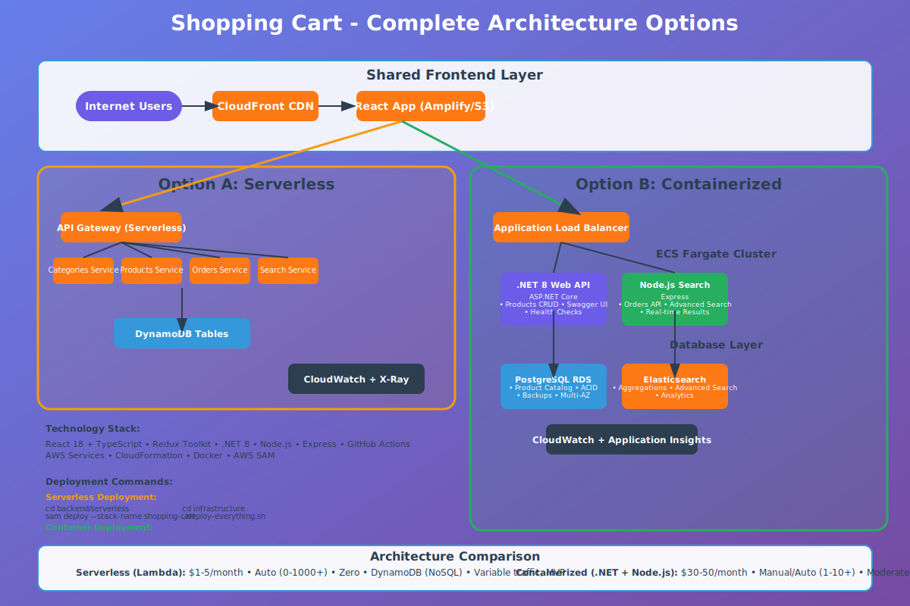
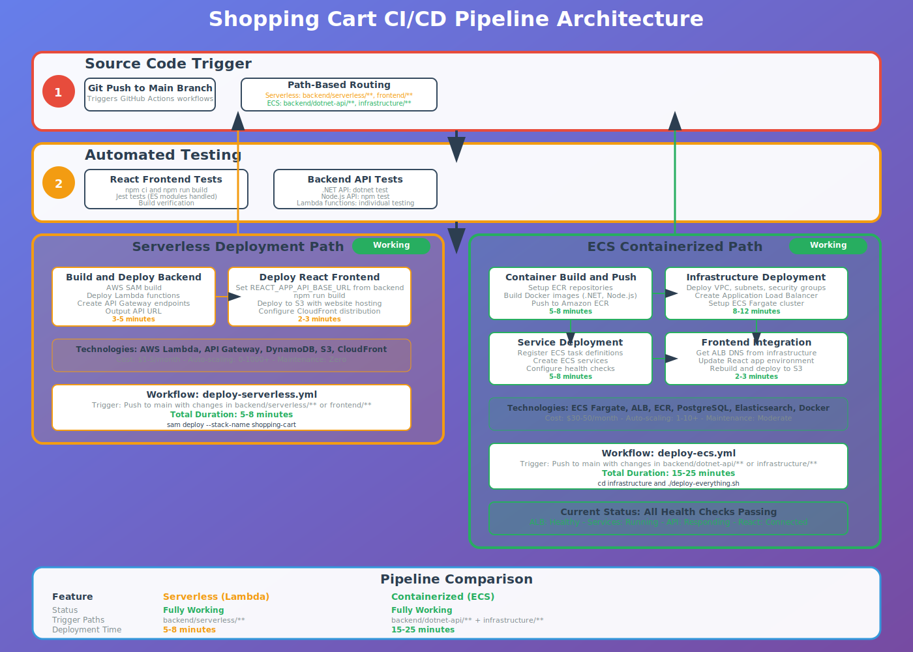

# 🛒 Shopping Cart Full-Stack Application

A modern, cloud-native shopping cart application showcasing **dual deployment architectures** - both **Serverless** and **Containerized (ECS)** approaches with complete CI/CD pipelines.

## 🏗️ Architecture Overview



This application demonstrates two complete deployment strategies:

### Option A: Serverless Architecture ✅

- **Frontend**: React app hosted on S3 + CloudFront
- **Backend**: AWS Lambda functions + API Gateway
- **Database**: DynamoDB
- **Cost**: $1-5/month (pay-per-use)
- **Best for**: Variable traffic, MVP, cost optimization

### Option B: Containerized Architecture ✅

- **Frontend**: React app hosted on S3 + CloudFront
- **Backend**: .NET Web API + Node.js Search API on ECS Fargate
- **Database**: PostgreSQL RDS + Elasticsearch
- **Load Balancer**: Application Load Balancer
- **Cost**: $30-50/month (always-on resources)
- **Best for**: Enterprise, consistent load, microservices

## 🚀 Live Demo

- **Serverless Demo**: http://serverless-shopping-cart-frontend-1753110732.s3-website-us-east-1.amazonaws.com/
- **ECS Demo**: [https://your-ecs-cloudfront-domain.com](https://your-ecs-cloudfront-domain.com)
- **API Documentation**: [http://your-alb-dns.amazonaws.com/swagger](http://your-alb-dns.amazonaws.com/swagger)

## 🛠️ Technology Stack

### Frontend

- **React 18** with TypeScript
- **Redux Toolkit** for state management
- **Material-UI** for components
- **Axios** for API calls

### Backend APIs

- **.NET 8 Web API** (Products, Categories, Orders)
- **Node.js Express** (Search functionality)
- **OpenAPI/Swagger** documentation

### Cloud Infrastructure

- **AWS ECS Fargate** (containerized services)
- **AWS Lambda** (serverless functions)
- **Application Load Balancer**
- **Amazon ECR** (container registry)
- **Amazon S3** + **CloudFront** (frontend hosting)
- **PostgreSQL RDS** / **DynamoDB**
- **Elasticsearch** / **DynamoDB Search**

### DevOps & CI/CD

- **GitHub Actions** (CI/CD pipelines)
- **AWS CloudFormation** (Infrastructure as Code)
- **Docker** (containerization)
- **AWS SAM** (serverless deployment)

## 📁 Project Structure

```
shopping-cart-fullstack/
├── frontend/                    # React application
│   ├── src/
│   │   ├── components/         # Reusable UI components
│   │   ├── pages/             # Page components
│   │   ├── services/          # API integration
│   │   ├── store/             # Redux state management
│   │   └── types/             # TypeScript definitions
│   ├── public/
│   └── package.json
│
├── backend/
│   ├── serverless/            # AWS Lambda functions
│   │   ├── src/
│   │   │   ├── categories/    # Categories Lambda
│   │   │   ├── products/      # Products Lambda
│   │   │   ├── orders/        # Orders Lambda
│   │   │   └── search/        # Search Lambda
│   │   └── template.yaml      # SAM template
│   │
│   ├── dotnet-api/            # .NET Web API (ECS)
│   │   ├── Controllers/
│   │   ├── Models/
│   │   ├── Services/
│   │   ├── Program.cs
│   │   └── Dockerfile
│   │
│   └── nodejs-search/         # Node.js Search API (ECS)
│       ├── routes/
│       ├── models/
│       ├── index.js
│       └── Dockerfile
│
├── infrastructure/            # ECS Infrastructure
│   ├── ecs-infrastructure.yaml
│   ├── ecs-services.yaml
│   ├── deploy-everything.sh
│   └── setup-scripts/
│
└── .github/
    └── workflows/
        ├── deploy-serverless.yml
        └── deploy-ecs.yml
```

## 🚀 Quick Start

### Prerequisites

- AWS CLI configured with appropriate permissions
- Node.js 18+ and npm
- .NET 8 SDK
- Docker (for ECS deployment)
- GitHub account

### 1. Clone Repository

```bash
git clone https://github.com/your-username/shopping-cart-fullstack.git
cd shopping-cart-fullstack
```

### 2. Install Dependencies

```bash
# Frontend
cd frontend
npm install

# Node.js API
cd ../backend/nodejs-search
npm install

# .NET API (restore packages)
cd ../dotnet-api
dotnet restore
```

### 3. Choose Deployment Option

#### Option A: Serverless Deployment 🚀

```bash
# Deploy serverless backend
cd backend/serverless
sam build
sam deploy --guided

# Deploy frontend
cd ../../frontend
npm run build
# Upload to S3 (automated via GitHub Actions)
```

#### Option B: ECS Containerized Deployment 🐳

```bash
# Deploy infrastructure and services
cd infrastructure
chmod +x *.sh
./deploy-everything.sh

# This will:
# 1. Create ECR repositories
# 2. Build and push Docker images
# 3. Deploy VPC, ALB, ECS cluster
# 4. Deploy services
# 5. Deploy React frontend
```

## 🔧 Configuration

### Environment Variables

#### Frontend (.env.production)

```bash
REACT_APP_API_BASE_URL=https://your-api-endpoint.com
REACT_APP_ORDERS_API_BASE_URL=https://your-api-endpoint.com
```

#### Backend APIs

```bash
# .NET API
ASPNETCORE_ENVIRONMENT=Production
DATABASE_CONNECTION_STRING=your-db-connection

# Node.js API
NODE_ENV=production
PORT=3001
ELASTICSEARCH_URL=your-elasticsearch-endpoint
```

## 📖 API Documentation

### Core Endpoints

#### Products API

```bash
GET    /api/products              # Get all products
POST   /api/products              # Create product
GET    /api/products/{id}         # Get product by ID
PUT    /api/products/{id}         # Update product
DELETE /api/products/{id}         # Delete product
GET    /api/products/search?q={}  # Search products
```

#### Categories API

```bash
GET    /api/categories            # Get all categories
POST   /api/categories            # Create category
GET    /api/categories/{id}       # Get category by ID
```

#### Orders API

```bash
GET    /api/orders                # Get all orders
POST   /api/orders                # Create order
GET    /api/orders/{id}           # Get order by ID
PUT    /api/orders/{id}/status    # Update order status
```

### API Response Format

```json
{
  "success": true,
  "data": {...},
  "message": "Operation completed successfully",
  "timestamp": "2025-07-22T12:00:00Z"
}
```

## 🔄 CI/CD Pipeline



### Shopping Cart CI/CD Pipeline Architecture

#### 🚀 Stage 1: Source Code Trigger

**Git Push to Main Branch** triggers GitHub Actions workflows based on path changes:

- **Serverless Path**: `backend/serverless/**`, `frontend/**`
- **ECS Path**: `backend/dotnet-api/**`, `backend/nodejs-search/**`, `infrastructure/**`

#### 🧪 Stage 2: Automated Testing

**React Frontend Tests:**

- `npm ci && npm run build`
- Jest tests (currently skipped due to ES modules)
- Build verification

**Backend API Tests:**

- .NET API: `dotnet test`
- Node.js API: `npm test` (if exists)
- Lambda functions: individual testing

#### 📦 Stage 3A: Serverless Deployment Path ✅ (Working)

**Build & Deploy Backend:**

- AWS SAM build
- Deploy Lambda functions
- Create API Gateway endpoints
- Output API URL

**Deploy React Frontend:**

- Set REACT_APP_API_BASE_URL from backend
- `npm run build`
- Deploy to S3 with website hosting
- Configure CloudFront distribution

#### 🐳 Stage 3B: ECS Containerized Path ✅ (Working)

**Container Build & Push:**

- Setup ECR repositories
- Build Docker images (.NET API, Node.js Search)
- Push to Amazon ECR
- Tag with latest

**Infrastructure Deployment:**

- Deploy VPC, subnets, security groups
- Create Application Load Balancer
- Setup ECS Fargate cluster
- Configure target groups

**Service Deployment:**

- Register ECS task definitions
- Create ECS services
- Configure health checks
- Connect to load balancer

**Frontend Integration:**

- Get ALB DNS name from infrastructure
- Update React app environment
- Rebuild and deploy to S3
- Invalidate CloudFront cache

### Pipeline Comparison

| Feature                  | Serverless (Lambda)     | Containerized (ECS)                           |
| ------------------------ | ----------------------- | --------------------------------------------- |
| **Status**               | ✅ Fully Working        | ✅ Fully Working                              |
| **Trigger Paths**        | `backend/serverless/**` | `backend/dotnet-api/**` + `infrastructure/**` |
| **Deployment Time**      | ~5-8 minutes            | ~15-25 minutes                                |
| **Frontend Environment** | API Gateway URL         | Application Load Balancer DNS                 |
| **Architecture**         | Direct SAM deployment   | Infrastructure → Services → Frontend update   |

### Automated Deployments

#### Serverless Pipeline

- **Trigger**: Push to `main` with changes in `backend/serverless/**` or `frontend/**`
- **Steps**: Test → Build → Deploy Lambda → Deploy Frontend
- **Duration**: ~5-8 minutes

#### ECS Pipeline

- **Trigger**: Push to `main` with changes in `backend/dotnet-api/**`, `backend/nodejs-search/**`, or `infrastructure/**`
- **Steps**: Test → Build Docker Images → Deploy Infrastructure → Deploy Services → Update Frontend
- **Duration**: ~15-25 minutes

### Manual Deployment

```bash
# Trigger serverless deployment
git add .
git commit -m "Update serverless backend"
git push origin main

# Trigger ECS deployment
git add infrastructure/
git commit -m "Update ECS infrastructure"
git push origin main
```

## 🧪 Testing

### Frontend Tests

```bash
cd frontend
npm test                    # Run Jest tests
npm run test:coverage       # Run with coverage
npm run test:e2e           # Run Cypress E2E tests
```

### Backend Tests

```bash
# .NET API
cd backend/dotnet-api
dotnet test

# Node.js API
cd backend/nodejs-search
npm test

# Lambda Functions
cd backend/serverless
sam local start-api        # Test locally
```

### Load Testing

```bash
# Install artillery
npm install -g artillery

# Run load tests
artillery run load-tests/api-load-test.yml
```

## 📊 Monitoring & Observability

### AWS CloudWatch

- **Application metrics**: Request latency, error rates, throughput
- **Infrastructure metrics**: CPU, memory, network utilization
- **Custom dashboards**: Business KPIs and technical metrics

### Logging

- **ECS**: CloudWatch Logs integration
- **Lambda**: Built-in CloudWatch Logs
- **Frontend**: CloudWatch RUM (Real User Monitoring)

### Health Checks

```bash
# ECS Health Check
curl http://your-alb-dns.amazonaws.com/api/health

# Serverless Health Check
curl https://your-api-gateway.amazonaws.com/health
```

## 🔐 Security

### Implemented Security Measures

- **HTTPS everywhere** (CloudFront, ALB, API Gateway)
- **CORS configuration** for cross-origin requests
- **VPC security groups** for network isolation
- **IAM roles** with least-privilege access
- **Secrets management** via AWS Systems Manager
- **Input validation** and sanitization

### Security Headers

```javascript
// Implemented in both architectures
{
  "Strict-Transport-Security": "max-age=31536000",
  "Content-Security-Policy": "default-src 'self'",
  "X-Content-Type-Options": "nosniff",
  "X-Frame-Options": "DENY"
}
```

## 💰 Cost Analysis

### Serverless (Pay-per-use)

- **Lambda**: ~$0.20 per 1M requests
- **API Gateway**: ~$3.50 per 1M requests
- **DynamoDB**: ~$1.25 per 1M read/write units
- **S3 + CloudFront**: ~$1-5/month
- **Total**: $1-15/month (depending on traffic)

### ECS (Always-on)

- **ECS Fargate**: ~$30/month (2 services, 0.25 vCPU each)
- **ALB**: ~$16/month
- **RDS**: ~$25/month (db.t3.micro)
- **S3 + CloudFront**: ~$1-5/month
- **Total**: $70-85/month

## 🚨 Troubleshooting

### Common Issues

#### 1. React App Shows "Network Error"

```bash
# Check API endpoints
curl http://your-api-endpoint.com/api/health

# Verify environment variables
cat frontend/.env.production

# Check CORS configuration
curl -H "Origin: https://your-frontend-domain.com" \
     -H "Access-Control-Request-Method: GET" \
     -H "Access-Control-Request-Headers: X-Requested-With" \
     -X OPTIONS \
     http://your-api-endpoint.com/api/products
```

#### 2. ECS Service Won't Start

```bash
# Check service events
aws ecs describe-services \
    --cluster shopping-cart-system-cluster \
    --services shopping-cart-system-dotnet-api

# Check task logs
aws logs get-log-events \
    --log-group-name /ecs/shopping-cart-system-dotnet-api \
    --log-stream-name your-log-stream
```

#### 3. Load Balancer Health Checks Failing

```bash
# Check target group health
aws elbv2 describe-target-health \
    --target-group-arn your-target-group-arn

# Test health endpoint directly
curl http://your-task-ip:port/api/health
```

### Debug Commands

```bash
# Check all ECS services
aws ecs list-services --cluster shopping-cart-system-cluster

# Check CloudFormation stacks
aws cloudformation list-stacks --stack-status-filter CREATE_COMPLETE UPDATE_COMPLETE

# Check ECR repositories
aws ecr describe-repositories

# Check S3 buckets
aws s3 ls | grep shopping-cart
```

## 🤝 Contributing

### Development Workflow

1. Fork the repository
2. Create feature branch: `git checkout -b feature/amazing-feature`
3. Make changes and test thoroughly
4. Commit: `git commit -m 'Add amazing feature'`
5. Push: `git push origin feature/amazing-feature`
6. Create Pull Request

### Code Standards

- **Frontend**: ESLint + Prettier configuration
- **Backend**: Follow language-specific conventions (.NET, Node.js)
- **Infrastructure**: CloudFormation best practices
- **Documentation**: Update README for any architectural changes

## 📝 License

This project is licensed under the MIT License - see the [LICENSE](LICENSE) file for details.

## 🙏 Acknowledgments

- AWS for comprehensive cloud services
- React and .NET communities for excellent documentation
- GitHub Actions for seamless CI/CD integration

## 📞 Support

- **Documentation**: Check this README and inline code comments
- **Issues**: Open GitHub issues for bugs or feature requests
- **Discussions**: Use GitHub Discussions for questions

---

**Built with ❤️ demonstrating modern DevOps practices with both serverless and traditional containerized architectures.**
