# Shopping Cart Full Stack - DevOps Project 🛒

A complete serverless e-commerce shopping cart system with automated DevOps pipeline, built with modern technologies and deployed on AWS.

## 🎯 Project Overview

This project demonstrates a **production-ready serverless architecture** with full DevOps automation, featuring React frontend, Node.js Lambda backend, and complete CI/CD pipeline.

**Live Demo**: [Your deployed URL here]
**Repository**: https://github.com/tsahirosenbaom/shopping-cart-fullstack

## 📊 CI/CD Pipeline Architecture

```mermaid
graph TB
    subgraph "Development"
        DEV[👨‍💻 Developer]
        LOCAL[🖥️ Local Development]
        DEV --> LOCAL
    end

    subgraph "Source Control"
        GITHUB[📚 GitHub Repository<br/>shopping-cart-fullstack]
        LOCAL --> |git push| GITHUB
    end

    subgraph "CI/CD Pipeline - GitHub Actions"
        TRIGGER[🔄 Trigger on Push to Main]

        subgraph "Build & Test Stage"
            TEST_FRONTEND[🧪 Test React App<br/>- Unit Tests<br/>- Type Checking<br/>- Lint]
            TEST_BACKEND[🧪 Test Lambda Functions<br/>- Unit Tests<br/>- Integration Tests]
            BUILD[🏗️ Build Applications<br/>- React Build<br/>- Lambda Packaging]
        end

        subgraph "Deploy Stage"
            DEPLOY_INFRA[☁️ Deploy Infrastructure<br/>- CloudFormation/SAM<br/>- Lambda Functions<br/>- API Gateway<br/>- DynamoDB]
            DEPLOY_FRONTEND[🚀 Deploy Frontend<br/>- Build React App<br/>- Upload to S3/Amplify<br/>- Invalidate CDN]
        end

        subgraph "Post Deploy"
            INTEGRATION_TEST[🔍 Integration Tests<br/>- API Health Checks<br/>- End-to-End Tests]
            NOTIFY[📱 Notifications<br/>- Slack/Email<br/>- Status Updates]
        end

        GITHUB --> TRIGGER
        TRIGGER --> TEST_FRONTEND
        TRIGGER --> TEST_BACKEND
        TEST_FRONTEND --> BUILD
        TEST_BACKEND --> BUILD
        BUILD --> DEPLOY_INFRA
        DEPLOY_INFRA --> DEPLOY_FRONTEND
        DEPLOY_FRONTEND --> INTEGRATION_TEST
        INTEGRATION_TEST --> NOTIFY
    end

    subgraph "AWS Cloud Environment"
        subgraph "Frontend Hosting"
            AMPLIFY[📱 AWS Amplify<br/>React SPA]
            CDN[🌐 CloudFront CDN<br/>Global Distribution]
            AMPLIFY --> CDN
        end

        subgraph "Backend Services"
            API[🔌 API Gateway<br/>REST Endpoints]

            subgraph "Lambda Functions"
                LAMBDA_CAT[⚡ Categories API]
                LAMBDA_PROD[⚡ Products API]
                LAMBDA_ORDER[⚡ Orders API]
                LAMBDA_HEALTH[⚡ Health Check]
            end

            API --> LAMBDA_CAT
            API --> LAMBDA_PROD
            API --> LAMBDA_ORDER
            API --> LAMBDA_HEALTH
        end

        subgraph "Data Layer"
            DDB_CAT[(🗄️ DynamoDB<br/>Categories)]
            DDB_PROD[(🗄️ DynamoDB<br/>Products)]
            DDB_ORDER[(🗄️ DynamoDB<br/>Orders)]

            LAMBDA_CAT --> DDB_CAT
            LAMBDA_PROD --> DDB_PROD
            LAMBDA_ORDER --> DDB_ORDER
        end

        subgraph "Monitoring"
            CLOUDWATCH[📊 CloudWatch<br/>Logs & Metrics]
            XRAY[🔍 X-Ray Tracing]

            LAMBDA_CAT --> CLOUDWATCH
            LAMBDA_PROD --> CLOUDWATCH
            LAMBDA_ORDER --> CLOUDWATCH
            API --> XRAY
        end

        DEPLOY_INFRA --> API
        DEPLOY_FRONTEND --> AMPLIFY
        CDN --> |HTTPS API Calls| API
    end

    subgraph "Users"
        USER[👥 End Users]
        USER --> CDN
    end

    style GITHUB fill:#24292e,stroke:#fff,color:#fff
    style AMPLIFY fill:#ff9900,stroke:#fff,color:#fff
    style API fill:#ff9900,stroke:#fff,color:#fff
    style LAMBDA_CAT fill:#ff9900,stroke:#fff,color:#000
    style LAMBDA_PROD fill:#ff9900,stroke:#fff,color:#000
    style LAMBDA_ORDER fill:#ff9900,stroke:#fff,color:#000
    style LAMBDA_HEALTH fill:#ff9900,stroke:#fff,color:#000
    style DDB_CAT fill:#3949ab,stroke:#fff,color:#fff
    style DDB_PROD fill:#3949ab,stroke:#fff,color:#fff
    style DDB_ORDER fill:#3949ab,stroke:#fff,color:#fff
    style CLOUDWATCH fill:#ff9900,stroke:#fff,color:#fff
```



## 🏗️ Architecture Overview

### Technology Stack

- **Frontend**: React 18 + TypeScript + Redux Toolkit + Tailwind CSS
- **Backend**: Node.js Lambda Functions + Express.js
- **Database**: Amazon DynamoDB (NoSQL)
- **API**: Amazon API Gateway (REST)
- **Hosting**: AWS Amplify + CloudFront CDN
- **CI/CD**: GitHub Actions
- **IaC**: AWS SAM (Serverless Application Model)
- **Monitoring**: CloudWatch + X-Ray

### System Components

```
┌─────────────────────────────────────────────────────────────┐
│                      🌍 Internet Users                      │
└─────────────────────┬───────────────────────────────────────┘
                      │ HTTPS
┌─────────────────────▼───────────────────────────────────────┐
│                  🌐 CloudFront CDN                          │
│                 (Global Edge Locations)                    │
└─────────────────────┬───────────────────────────────────────┘
                      │
┌─────────────────────▼───────────────────────────────────────┐
│                 📱 AWS Amplify                              │
│              (React SPA Hosting)                           │
└─────────────────────┬───────────────────────────────────────┘
                      │ REST API Calls
┌─────────────────────▼───────────────────────────────────────┐
│                 🔌 API Gateway                              │
│      (CORS, Rate Limiting, Authentication)                 │
└─┬─────────┬─────────┬─────────┬─────────┬─────────────────┬─┘
  │         │         │         │         │                 │
  ▼         ▼         ▼         ▼         ▼                 ▼
┌───────┐ ┌───────┐ ┌───────┐ ┌───────┐ ┌───────┐       ┌───────┐
│⚡Cat. │ │⚡Prod.│ │⚡Order│ │⚡Health│ │⚡Search│       │⚡Seed │
│Lambda │ │Lambda │ │Lambda │ │Lambda │ │Lambda │       │Lambda │
└───┬───┘ └───┬───┘ └───┬───┘ └───────┘ └───────┘       └───────┘
    │         │         │
    ▼         ▼         ▼
┌─────────────────────────────────────────────────────────────┐
│                    🗄️ DynamoDB Tables                       │
│  ┌─────────────┐ ┌─────────────┐ ┌─────────────────────┐   │
│  │ Categories  │ │  Products   │ │       Orders        │   │
│  │   Table     │ │    Table    │ │       Table         │   │
│  │  (Pay-per-  │ │ (Pay-per-   │ │    (Pay-per-        │   │
│  │   request)  │ │  request)   │ │     request)        │   │
│  └─────────────┘ └─────────────┘ └─────────────────────┘   │
└─────────────────────────────────────────────────────────────┘
                              │
                              ▼
┌─────────────────────────────────────────────────────────────┐
│              📊 CloudWatch + 🔍 X-Ray                       │
│           (Monitoring, Logging, Tracing)                   │
└─────────────────────────────────────────────────────────────┘
```

## 🚀 DevOps Pipeline Stages

### 1. Source Stage

- **Trigger**: Push to `main` branch
- **Repository**: GitHub with branch protection
- **Webhook**: Automatic trigger to GitHub Actions

### 2. Build & Test Stage

```yaml
jobs:
  test:
    runs-on: ubuntu-latest
    steps:
      - name: Test Frontend
        run: |
          cd frontend
          npm ci
          npm run test:coverage
          npm run lint
          npm run type-check

      - name: Test Backend
        run: |
          cd backend/serverless
          npm ci
          npm test
          npm run integration-test
```

### 3. Infrastructure Deployment

```yaml
deploy-infrastructure:
  needs: test
  steps:
    - name: Deploy SAM Stack
      run: |
        sam build
        sam deploy --stack-name shopping-cart-prod
```

### 4. Application Deployment

```yaml
deploy-application:
  needs: deploy-infrastructure
  steps:
    - name: Deploy Frontend
      run: |
        cd frontend
        npm run build
        aws s3 sync build/ s3://$BUCKET_NAME
```

### 5. Post-Deployment Validation

- Health check endpoints
- Integration tests
- Performance validation
- Security scanning

## 📦 Project Structure

```
shopping-cart-fullstack/
├── 📁 .github/workflows/           # GitHub Actions CI/CD
│   ├── deploy-serverless.yml       # Serverless deployment pipeline
│   └── deploy-ecs.yml              # Container deployment pipeline
├── 📁 frontend/                    # React Application
│   ├── 📁 src/
│   │   ├── 📁 components/          # Reusable UI components
│   │   ├── 📁 pages/               # Route components
│   │   ├── 📁 store/               # Redux state management
│   │   ├── 📁 services/            # API integration layer
│   │   └── 📁 types/               # TypeScript definitions
│   ├── package.json
│   └── tsconfig.json
├── 📁 backend/
│   ├── 📁 serverless/              # AWS Lambda Functions
│   │   ├── 📄 template.yaml        # SAM Infrastructure as Code
│   │   └── 📁 src/
│   │       ├── 📁 categories/      # Categories API Lambda
│   │       ├── 📁 products/        # Products API Lambda
│   │       ├── 📁 orders/          # Orders API Lambda
│   │       ├── 📁 health/          # Health Check Lambda
│   │       └── 📁 seed/            # Database Seeding Lambda
│   ├── 📁 dotnet-api/              # .NET Web API (Alternative)
│   └── 📁 nodejs-search/           # Node.js Search Service
├── 📁 infrastructure/              # Infrastructure as Code
│   ├── ecs-infrastructure.yaml     # ECS CloudFormation
│   └── ecs-services.yaml           # ECS Services Configuration
├── 📁 scripts/                     # Utility scripts
│   ├── verify-setup.sh             # Environment verification
│   ├── setup-local-dev.sh          # Local development setup
│   └── deploy-everything.sh        # Manual deployment script
├── 📄 README.md                    # This file
├── 📄 package.json                 # Project configuration
└── 📄 .gitignore                   # Git ignore rules
```

## 🛠️ Local Development Setup

### Prerequisites

- Node.js 18+
- .NET 8 SDK
- AWS CLI configured
- SAM CLI (for serverless development)
- Git

### Quick Start

```bash
# 1. Clone the repository
git clone https://github.com/tsahirosenbaom/shopping-cart-fullstack.git
cd shopping-cart-fullstack

# 2. Verify your setup
npm run verify

# 3. Install all dependencies
npm run setup-local

# 4. Start development servers (separate terminals)
npm run dev:frontend    # React app on :3000
npm run dev:backend     # .NET API on :5002
npm run dev:search      # Node.js API on :3001
npm run dev:serverless  # Lambda local on :3000
```

### Available Scripts

```bash
# Development
npm run dev:frontend     # Start React development server
npm run dev:backend      # Start .NET API server
npm run dev:search       # Start Node.js search API
npm run dev:serverless   # Start SAM local API

# Testing
npm run test:all         # Run all tests
npm run test:frontend    # Test React components
npm run test:backend     # Test .NET API
npm run test:integration # End-to-end tests

# Building
npm run build:frontend   # Build React for production
npm run build:backend    # Build .NET API

# Deployment
npm run deploy:serverless # Deploy serverless stack
npm run deploy:ecs       # Deploy ECS stack

# Utilities
npm run verify           # Verify local setup
npm run setup-local      # Install all dependencies
```

## 🌐 API Documentation

### Base URLs

- **Production**: `https://api.shopping-cart.example.com`
- **Staging**: `https://staging-api.shopping-cart.example.com`
- **Local**: `http://localhost:3000` (SAM Local)

### Endpoints

#### Categories API

```http
GET    /api/categories           # List all categories
POST   /api/categories           # Create new category
PUT    /api/categories/{id}      # Update category
DELETE /api/categories/{id}      # Delete category
```

#### Products API

```http
GET    /api/products             # List all products
GET    /api/products/{id}        # Get product by ID
GET    /api/products/search      # Search products (?query=term)
POST   /api/products             # Create new product
PUT    /api/products/{id}        # Update product
DELETE /api/products/{id}        # Delete product
```

#### Orders API

```http
GET    /api/orders               # List orders
GET    /api/orders/{id}          # Get order by ID
POST   /api/orders               # Create new order
PUT    /api/orders/{id}          # Update order status
```

#### Health Check

```http
GET    /health                   # System health status
```

### Sample API Response

```json
{
  "status": "success",
  "data": {
    "id": 1,
    "name": "Gaming Laptop",
    "description": "High-performance gaming laptop",
    "price": 1299.99,
    "categoryId": 1,
    "stock": 50,
    "createdAt": "2025-01-20T10:30:00Z"
  }
}
```

## 🧪 Testing Strategy

### Frontend Testing

- **Unit Tests**: Jest + React Testing Library
- **Component Tests**: Isolated component testing
- **Integration Tests**: API integration testing
- **E2E Tests**: Cypress for user workflow testing

### Backend Testing

- **Unit Tests**: Jest for Lambda functions
- **Integration Tests**: API Gateway + Lambda integration
- **Contract Tests**: API contract validation
- **Performance Tests**: Load testing with Artillery

### Test Coverage Targets

- **Frontend**: > 80% code coverage
- **Backend**: > 85% code coverage
- **Integration**: All critical user paths

## 🔒 Security & Best Practices

### Security Measures

- **Authentication**: JWT-based authentication
- **Authorization**: Role-based access control
- **Input Validation**: Comprehensive input sanitization
- **CORS**: Properly configured CORS policies
- **Rate Limiting**: API rate limiting to prevent abuse
- **HTTPS**: All traffic encrypted in transit
- **Secrets Management**: AWS Secrets Manager for sensitive data

### Code Quality

- **TypeScript**: Type safety across the application
- **ESLint**: Code linting with strict rules
- **Prettier**: Consistent code formatting
- **Husky**: Pre-commit hooks for quality gates
- **SonarQube**: Static code analysis (optional)

### Infrastructure Security

- **IAM**: Least privilege access policies
- **VPC**: Network isolation (when applicable)
- **Encryption**: At-rest and in-transit encryption
- **Monitoring**: Comprehensive logging and alerting

## 📊 Performance & Monitoring

### Key Metrics

- **Response Time**: < 200ms average API response
- **Availability**: 99.9% uptime target
- **Error Rate**: < 0.1% error rate
- **Throughput**: 1000+ requests per second capacity

### Monitoring Stack

- **CloudWatch**: AWS native monitoring
- **X-Ray**: Distributed tracing
- **Custom Metrics**: Business metrics tracking
- **Alerting**: PagerDuty/Slack integration

### Performance Optimizations

- **CDN**: Global content distribution
- **Caching**: Multi-layer caching strategy
- **Database**: Optimized queries and indexes
- **Lambda**: Right-sized memory allocation
- **API Gateway**: Response caching enabled

## 💰 Cost Analysis

### Monthly Cost Breakdown (Estimated)

```
🏗️ Infrastructure Costs:
├── AWS Lambda (1M requests)      $0.20
├── API Gateway (1M requests)     $3.50
├── DynamoDB (1M RW requests)     $1.25
├── Amplify Hosting (5GB)         $0.50
├── CloudFront (100GB transfer)   $8.50
├── CloudWatch Logs (10GB)        $2.50
└── Miscellaneous                 $3.55
                                --------
💰 Total Estimated Cost          ~$20/month
```

### Cost Optimization Strategies

- **Pay-per-use**: Serverless architecture scales to zero
- **Reserved Capacity**: For predictable workloads
- **Caching**: Reduce API calls and database requests
- **Monitoring**: Track and optimize high-cost operations
- **Right-sizing**: Optimal Lambda memory allocation

## 🚀 Deployment Options

### Option 1: Serverless (Recommended)

- **Cost**: $5-20/month
- **Scaling**: Automatic (0 to millions)
- **Maintenance**: Minimal
- **Best for**: Variable traffic, cost optimization

### Option 2: Container (ECS)

- **Cost**: $30-50/month
- **Scaling**: Manual/Auto-scaling
- **Maintenance**: Moderate
- **Best for**: Consistent traffic, enterprise requirements

## 🌍 Environment Strategy

### Development Environment

- **Local**: Full stack running locally
- **Services**: Mock services and local databases
- **Testing**: Unit and integration tests

### Staging Environment

- **Purpose**: Pre-production validation
- **Data**: Synthetic test data
- **Testing**: Full regression testing

### Production Environment

- **High Availability**: Multi-AZ deployment
- **Monitoring**: Full observability stack
- **Backup**: Automated backup and recovery

## 📈 Scalability & Performance

### Auto Scaling Configuration

```yaml
# Lambda Auto Scaling
ReservedConcurrency: 100
ProvisionedConcurrency: 10

# API Gateway Throttling
ThrottleSettings:
  BurstLimit: 2000
  RateLimit: 1000

# DynamoDB Auto Scaling
BillingMode: PAY_PER_REQUEST
```

### Performance Benchmarks

- **Cold Start**: < 500ms
- **Warm Requests**: < 100ms
- **Database Queries**: < 50ms
- **Page Load**: < 2 seconds

## 🤝 Contributing

### Development Workflow

1. **Fork** the repository
2. **Create** feature branch (`git checkout -b feature/amazing-feature`)
3. **Commit** changes (`git commit -m 'Add amazing feature'`)
4. **Push** branch (`git push origin feature/amazing-feature`)
5. **Open** Pull Request

### Code Standards

- Follow TypeScript/JavaScript style guide
- Write meaningful commit messages
- Include tests for new features
- Update documentation as needed

### Pull Request Process

1. Ensure all tests pass
2. Update README if needed
3. Request review from maintainers
4. Address review feedback
5. Squash commits before merge

## 📚 Additional Resources

### Documentation

- [AWS SAM Developer Guide](https://docs.aws.amazon.com/serverless-application-model/)
- [React Documentation](https://reactjs.org/docs/)
- [TypeScript Handbook](https://www.typescriptlang.org/docs/)
- [DynamoDB Best Practices](https://docs.aws.amazon.com/amazondynamodb/latest/developerguide/best-practices.html)

### Useful Links

- **Live Application**: [Production URL]
- **Staging Environment**: [Staging URL]
- **API Documentation**: [API Docs URL]
- **Monitoring Dashboard**: [CloudWatch URL]
- **CI/CD Pipeline**: [GitHub Actions URL]

## 🐛 Troubleshooting

### Common Issues

#### Local Development

```bash
# Port already in use
npm run verify                    # Check port availability
lsof -ti:3000 | xargs kill -9    # Kill process on port 3000

# Dependencies issues
npm run setup-local               # Reinstall all dependencies
npm cache clean --force           # Clear npm cache
```

#### Deployment Issues

```bash
# AWS credentials
aws sts get-caller-identity       # Verify AWS access
aws configure list                # Check configuration

# SAM deployment
sam build                         # Build SAM application
sam deploy --debug               # Deploy with debug info
```

#### API Issues

```bash
# Test API endpoints
curl https://api-url/health       # Health check
npm run test:integration         # Run integration tests
```

## 📞 Support & Contact

### Getting Help

- **Issues**: Create GitHub issue for bugs
- **Questions**: Use GitHub discussions
- **Security**: Email security@example.com
- **General**: Contact team@example.com

### Maintainers

- **Tsahi Rosenbaum** - [@tsahirosenbaom](https://github.com/tsahirosenbaom)

---

## 🎉 Acknowledgments

Built with ❤️ using modern DevOps practices and cloud-native technologies.

**⭐ If this project helped you, please give it a star!**

---

_Last updated: January 2025_
